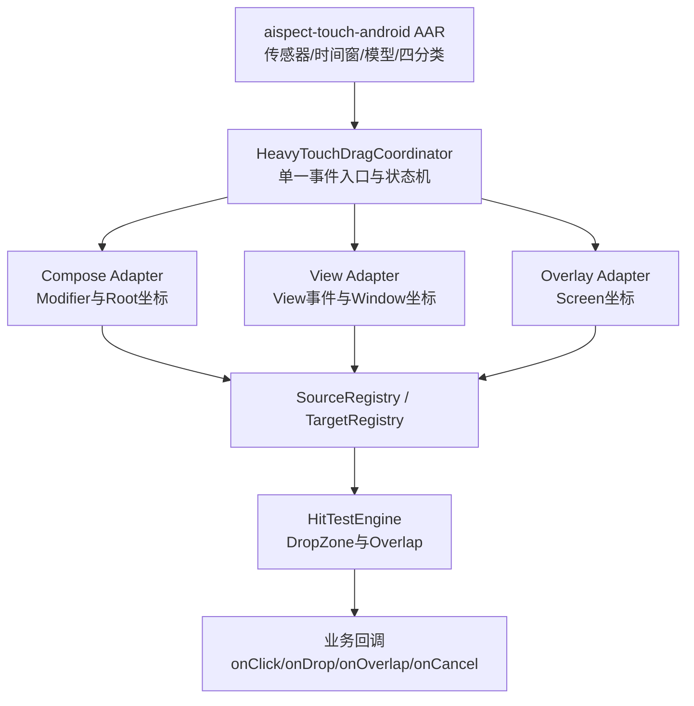
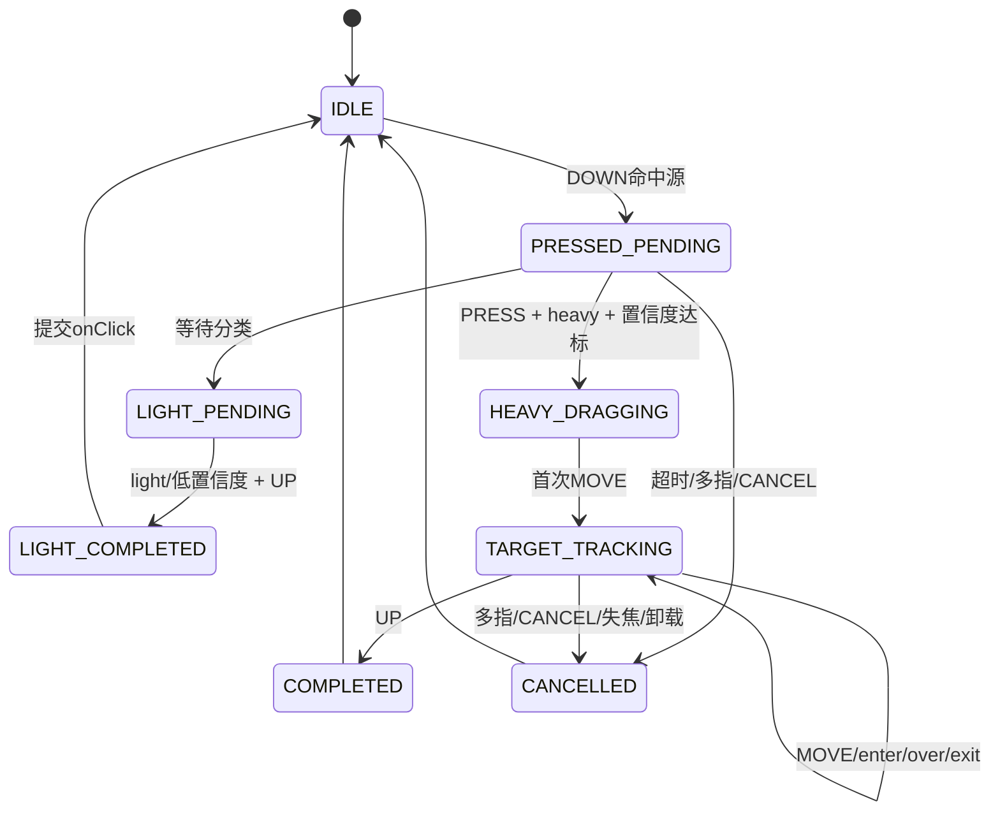

# 通用重触拖拽系统设计

状态：设计已冻结，首版核心与 Compose 测试页已实现；传统 View/Overlay 业务接入待后续验收

适用项目：`superAppAndroid`

## 1. 目标与边界

本设计为任意 UI 组件提供声明式的“轻触点击、重触拖拽”能力。组件只需声明自己是可重触拖拽源，即可参与统一手势协调；组件也可以声明为显式拖放区或重叠目标，并绑定相应业务事件。

必须满足：

- 轻触不移动源组件，只提交一次点击事件。
- 只有当前触摸序列收到 `PRESS + heavy + confidence` 达标结果后，才开始拖动。
- 一个根 UI 只存在一个触摸协调器和一个触摸 SDK 事件入口。
- 未声明能力的 UI 不改变原有点击、滚动和普通拖动行为。
- 触摸分类 SDK 不依赖 View、Compose、Overlay 或业务 payload。
- 拖放区与 UI 重叠是两种不同的目标语义。

本设计不解决跨 App 的系统级拖放。跨窗口场景只有在能够转换到同一屏幕坐标系时才支持；无法可靠转换时，禁止重叠判定。

## 2. 现状证据与设计结论

| 现状证据 | 影响 | 设计结论 |
|---|---|---|
| `TouchTestActivity` 通过一个 `pointerInteropFilter` 接收整块触摸区域 | 当前逻辑只能移动一个测试方块 | 提取为根级通用协调器 |
| SDK 结果异步返回 | `DOWN` 后不能让子控件先消费，再追回事件 | 协调器从 `DOWN` 起持有候选序列 |
| `EdgeGestureDetector` 只处理边缘滑动 | 与重触拖放职责不同 | 不复用为业务拖拽引擎 |
| Compose 已有 `boundsInRoot()` 和 `Rect` 几何基础 | 可以统一登记组件边界 | 建立目标注册表和命中引擎 |
| AAR 只提供触摸分类 | SDK 不应知道 UI 业务 | 拖拽系统放在宿主交互层 |

证据路径：

- `app/src/main/java/com/paifa/univerge/app/TouchTestActivity.kt`
- `univerge-overlay/src/main/kotlin/com/paifa/univerge/overlay/EdgeGestureDetector.kt`
- `univerge-accessibility/src/main/kotlin/com/paifa/univerge/accessibility/floatingchat/tools/RightCoordinateRail.kt`
- `C:/codeDev/cnn/sdk/aispect-touch-android/README.md`

## 3. 分层架构



### 3.1 触摸分类 SDK

SDK 只负责：

- 持续传感器采集和因果窗口构建；
- 接收宿主转发的 `MotionEvent`；
- 返回四分类结果、置信度、模型信息和错误；
- 模型更新和生命周期管理。

SDK 不得依赖：

- `View`、`Modifier`、Compose 状态；
- 拖动源、目标注册表；
- 业务对象和业务回调；
- 具体 UI 的位置或绘制方式。

### 3.2 核心协调层

建议模块名：`univerge-heavy-drag-core`。

核心层使用纯 Kotlin 数据结构，负责：

- 当前手势会话和 `gestureId`；
- 轻触/重触状态机；
- 事件所有权；
- 源和目标注册；
- 命中结果和事件顺序；
- 超时、取消、多指和卸载处理。

核心层不直接修改 UI 位置，只发布拖动事件。

### 3.3 UI 适配层

- `univerge-heavy-drag-compose`：提供 Compose `Modifier` 和 `boundsInRoot()` 登记。
- `univerge-heavy-drag-android`：提供传统 View 适配、`MotionEvent` 分发和 Window 坐标转换。
- Overlay/无障碍使用独立适配器，转换到屏幕坐标后才能参与跨窗口命中。

## 4. 声明式合同

### 4.1 拖动源

示意 API：

```kotlin
Modifier.heavyDraggable(
    sourceId = "item-42",
    payload = payload,
    enabled = true,
    onClick = { payload -> },
    onDragStart = { session -> },
    onDrag = { event -> },
    onDragEnd = { event -> },
    onDragCancel = { reason -> }
)
```

源合同必须包含：

| 字段 | 说明 |
|---|---|
| `sourceId` | 在当前 Root 内稳定且唯一 |
| `payload` | 业务数据，核心层只保存引用或不可变快照 |
| `enabled` | 是否参与重触候选 |
| `bounds` | 由适配层持续更新 |
| `onClick` | 轻触提交回调 |
| `onDragStart/onDrag/onDragEnd` | 重触拖动生命周期 |
| `onDragCancel` | 取消和失败回调 |

只有触点 `DOWN` 命中源边界时，源才成为当前候选。不能像当前测试页一样让触摸区域内任意位置移动一个固定方块。

### 4.2 显式拖放区

```kotlin
Modifier.heavyDropTarget(
    targetId = "folder-a",
    mode = HeavyTargetMode.DROP_ZONE,
    priority = 10,
    accepts = { payload -> true },
    onEnter = { event -> },
    onOver = { event -> },
    onExit = { event -> },
    onDrop = { event -> }
)
```

语义是“释放时提交”。事件顺序必须是：

```text
onEnter → 0..N 次 onOver → onExit 或 onDrop
```

### 4.3 重叠目标

```kotlin
Modifier.heavyDropTarget(
    targetId = "other-ui",
    mode = HeavyTargetMode.OVERLAP,
    overlapEnterThreshold = 0.20f,
    overlapExitThreshold = 0.10f,
    accepts = { payload -> true },
    onOverlapEnter = { event -> },
    onOverlap = { event -> },
    onOverlapExit = { event -> },
    onOverlapCommit = { event -> }
)
```

重叠目标判断拖动源实际矩形与目标矩形的交集比例，不只判断手指坐标：

```text
intersectionArea / sourceArea >= enterThreshold
```

使用不同的进入和离开阈值，避免边界附近抖动。

## 5. 手势状态机



规则：

1. `DOWN` 生成新的 `gestureId`，记录源、触点、起始矩形和模型会话。
2. `PRESSED_PENDING` 中 SDK 接收事件，但普通 UI 不提交点击或拖动。
3. 只有当前 `gestureId` 收到 `PRESS + heavy` 且置信度达到策略阈值，才进入 `HEAVY_DRAGGING`。
4. 分类前的 MOVE 只缓存最新位置，不移动 UI；超过允许位移时取消候选。
5. `UP` 早于分类完成时，不能事后启动拖动；按配置选择取消或提交轻触。
6. 同一手势最多产生一次 `onDragStart` 和一次终结事件。

## 6. 事件所有权和 `gestureId`

每个 UI Root 只能有一个协调器和一个 SDK 事件入口：

```text
Root Coordinator → AispectTouchClassifier.handleMotionEvent()
```

组件不得各自创建 classifier。

每次 `ACTION_DOWN` 创建 `gestureId`。理想情况下 SDK 结果也携带该 ID；在 SDK 尚未扩展该字段前，由 Android 适配层保存“当前活动手势”并丢弃：

- 当前手势已结束后的结果；
- 结果时间早于当前 `DOWN` 的回调；
- 与当前源或当前事件序列不匹配的回调。

长期合同应在 SDK 结果中增加 `gestureId`，而不是依赖时间猜测。

## 7. 命中、坐标和优先级

### 7.1 坐标空间

| 场景 | 统一坐标 |
|---|---|
| 同一 Compose Root | Root 坐标，来自 `boundsInRoot()` |
| 同一 Android Window | Window 坐标 |
| Overlay/无障碍窗口 | Screen 坐标 |
| 跨 App | 不纳入本系统；另行使用系统 DragEvent |

所有边界在布局、滚动、旋转、窗口变化时更新；组件注销时移除注册。

### 7.2 目标筛选

显式 Drop Zone 选择唯一目标时使用：

```text
enabled
→ accepts(payload)
→ priority
→ zIndex
→ 几何命中比例
→ 注册顺序
```

Overlap Target 默认允许多个目标并行收到事件。若业务要求唯一目标，应显式配置选择策略，不能依赖遍历顺序。

### 7.3 命中计算

- Drop Zone：默认使用拖动锚点或可配置的拖动源中心点。
- Overlap Target：使用源矩形与目标矩形的 AABB 交集比例。
- 不允许使用不同坐标空间的矩形直接比较。
- 目标边界无效或过期时，不触发提交事件。

## 8. 生命周期、线程和性能

- 触摸事件入口运行在 UI 线程，但状态转换必须是 O(1) 或与注册目标数线性可控。
- 模型推理保持 SDK 自己的后台机制，不在 UI 线程同步推理。
- 磁盘写入、远程模型刷新和日志不得阻塞拖动事件。
- 几何边界只在布局变化时更新，不在每个 MOVE 重新查询布局。
- MOVE 事件可在协调器内合并到最近一帧，但不得改变 enter/exit/drop 顺序。
- 目标数量较大时使用空间索引或分区，避免每个 MOVE 扫描全部 UI。
- 每个会话结束时释放 payload 引用、目标候选和临时矩形，避免泄漏。

## 9. 异常和安全策略

| 情况 | 行为 |
|---|---|
| 多指 | 立即取消，不触发 drop/overlap commit |
| `ACTION_CANCEL` | 调用 `onDragCancel`，清除候选目标 |
| 窗口失焦 | 取消当前会话 |
| 源组件卸载 | 取消当前会话并注销源 |
| 目标卸载 | 先发 exit，再移除目标 |
| 低置信度 | 不进入重触拖动 |
| 模型不可用 | 按轻触失败策略处理，不移动 UI |
| 分类超时 | 不得事后启动拖动 |
| 模型切换 | 当前会话继续使用原模型，下一会话生效 |
| 回调重复 | 协调器保证终结事件幂等 |

业务回调异常不得破坏协调器状态；应捕获并记录，再完成会话清理。

## 10. 与现有模块的关系

```text
aispect-touch-android.aar
  独立发布，保持 UI 无关

univerge-heavy-drag-core
  建议新建，纯 Kotlin

univerge-heavy-drag-compose
  建议新建，Compose 适配

univerge-overlay
  继续处理边缘滑动；通过适配器接入，不复用 EdgeGestureDetector 内部状态

univerge-accessibility
  继续处理无障碍窗口；跨窗口使用 Screen 坐标适配

app
  只声明源和目标、绑定业务回调
```

### 10.1 纯文本消息测试接入

当前测试只对 `FloatingChatMessageType.Text` 且非 `System` 的消息气泡声明
`heavyDraggable`。声明点位于 `MessageBlock` 的完整气泡外壳，而不是内部
`TextLabel`；源 ID 使用 `message.id`，payload 使用不可变消息对象。普通会话和
未回消息总览都复用 `MessageRow`，因此两条列表路径同时覆盖。

`univerge-accessibility` 通过 `HeavyDragRuntimeProvider` 接收可选的通用运行时。
App 在 `UniVergeApplication` 中注入 Aispect classifier，Overlay Compose 根只建立
一个 `HeavyDragHost`。没有 provider 时，消息仍走原有点击、双击、长按和滚动逻辑；
accessibility 模块不引用 Aispect SDK。

当前 `TouchTestActivity` 的方块拖动只能作为演示适配器，不能作为通用实现基础。

## 11. 推荐实施顺序

1. 冻结 `HeavyDragSource`、`HeavyDragTarget`、`HeavyDragEvent` 和 `gestureId` 合同。
2. 实现纯 Kotlin 状态机，不依赖 Android 或 Compose。
3. 为状态机补齐轻触、重触、超时、多指、取消和过期结果测试。
4. 实现 Android Root 适配器和唯一 SDK 事件入口。
5. 实现目标注册表和矩形命中引擎。
6. 实现 Compose `Modifier` 适配器。
7. 将 `TouchTestActivity` 改造成第一个真实消费者。
8. 再接入传统 View 和 Overlay。
9. 最后评估是否需要跨窗口系统 DragEvent。

## 12. 验收标准

实现完成后必须证明：

- 任意声明 `heavyDraggable` 的组件都能参与重触拖动。
- 未声明组件的点击、滚动和普通拖动行为不变。
- 轻触只触发一次 `onClick`，源位置不改变。
- 重触只有在当前手势分类确认后才触发 `onDragStart`。
- 多个源组件可以同时注册但一次手势只有一个源。
- Drop Zone 的 enter/over/exit/drop 顺序稳定。
- Overlap Target 的进入、持续、离开和提交事件稳定。
- 旧手势结果不会污染下一笔手势。
- Compose、View、Overlay 适配器不改变核心状态机语义。
- 触摸 SDK 不引用 UI、目标注册表或业务 payload。
- 核心层不直接修改 UI，不执行业务动作。
- 所有取消路径都能释放会话资源且不产生错误提交。

当前实现对应关系：

- `univerge-heavy-drag-core`：纯 Kotlin 状态机、注册表、命中和事件合同。
- `univerge-heavy-drag-android`：根级 `MotionEvent` 入口和传统 View Host。
- `univerge-heavy-drag-compose`：`HeavyDragHost`、`heavyDraggable`、`heavyDropTarget`、`heavyOverlapTarget`。
- `TouchTestActivity`：首个实际消费者，包含一个拖动源、一个拖放区和一个重叠目标。
- Aispect SDK：独立 AAR `1.2.0`，结果和错误携带 `gestureId`；Aispect 转换只存在于 App 适配器。

尚未完成的范围：`univerge-accessibility`、`univerge-overlay` 尚未接入具体业务控件，ADB 真机验收需要设备恢复为授权的 `device` 状态。任何实现变更都应先对照本合同，若需要改变事件所有权、坐标空间或 SDK 公共结果字段，应先更新本文件并重新评审。

## 附录：业界机制映射

| 业界机制 | 本项目采用方式 |
|---|---|
| Android `DragEvent` 的 enter/over/exit/drop | Drop Zone 事件生命周期 |
| Compose pointer input 的事件消费和分发 pass | 根协调器统一持有事件，确认后消费 |
| W3C Pointer Capture | `gestureId + activePointerId` 的会话归属 |
| Unity EventSystem 的 drag/drop handler 分离 | 源、目标和业务回调分层 |
| Web DataTransfer 与拖动几何分离 | payload 与 bounds 分离 |
| 游戏引擎碰撞检测 | Overlap Target 的矩形交集和滞后阈值 |
